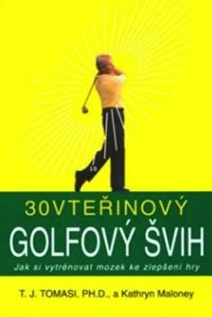

Knihy pro minigolfisty
======================

Specificky minigolfově zaměřených knih moc není, proto je velmi obtížné je
sehnat. Proto se v tomto textu budu zabývat i knihami, které mohou hráčům
dráhového golfu přinést nějaké zajímavé informace. Knihy budu postupně
přidávat, jak se mi dostanou pod ruce.

30vteřinový golfový švih (T.J.Tomasi, Kathryn Maloney)
------------------------------------------------------

Kniha má podtitul "Jak si vytrénovat mozek ke zlepšení hry" a poskytuje i
minigolfistům několik zajímavých postřehů k&nbsp;danému tématu.

Autoři se systématicky zabývají celou hrou od tréninkové přípravy (zlepšování
svého profilu předností a slabin, přeneseno do minigolfového světa
např. znalosti míčů, jejich tepelných vlastností, úderového arzenálu, liftů
apod.), po přípravu na konkrétní hřiště, až po přípravu na jeden každý
úder. Pojmenovávají čtyři základní přístupy ke hře samotné (terminátor,
analyzátor, scénárista a rozšafa) jako cípy hvězdy, kterou je vhodné v určitých
chvílích hry "natáčet" podle aktuální situace.

Asi nejzásadnější je ale pojmenování a vysvětlení signálu Go! resp. No!. Znáte
to, připravujete se na úder, založíte hůl a při míření se ozve vnitřní hlas,
podvědomí: "Teď ne!". Pozadí tohoto stavu mysli je v&nbsp;knize velmi hezky
vysvětleno. Poslouchejte své podvědomí! Velmi hezky jsou také popsány
charakteristiky hráčů, kteří hrají v "zóně", tedy v&nbsp;proudu Go! signálů:

- zejména nad míčkem jsou absolutně zklidněni, nedávají průchod emocím

- nevykazují žádné rozpory, chtějí dodržet svůj plán daného úderu

- k úderu jsou odhodlaní, rozhodní

- žádné myšlenky na to, co se stane pokud se úder nepovede (jak budu dohrávat,
  co když míč přejede/podjede)? Žádná představivost "zla", než skutečně
  nastane.

V této souvislosti je v knize nádherná pasáž o tom, jak architekti golfových
hřišť "bojují" s hráči tím, že jim vytváří stresové situace tvarem a
rozmístěním překážek, a že milují, když hráče velkého golfu nutí vybírat mezi
holemi, být na pochybách.

30vteřinový švih podle autorů obsahuje vytvoření plánu úderu, vizualizaci
takového úderu, samotné provedení úderu, ale i jeho vyhodnocení a případný
"záznam" ve vizuální paměti. Každé z&nbsp;těchto částí se pak autoři velmi
podrobně věnují.

I přesto, že je kniha psána hlavně o golfu, jednoznačně ji mohu doporučit i
hráčům minigolfu.

